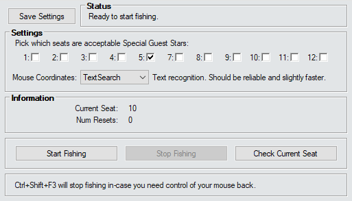
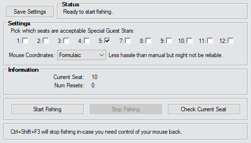
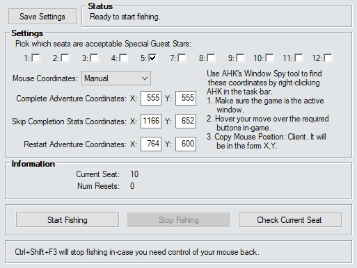

# DM Fishing Minigame

This is an addon that will retry an adventure until DM picks the Guest Star seat that you want. Simply pick a selection of acceptable seats and then click `Start Fishing`.

> [!IMPORTANT]
> *Make sure when you start that there are no UI elements open in-game. This script has no idea what state the user interface is in - so if you have extra stuff open - or you aren't in an adventure - it may end up clicking them by mistake.*

> [!NOTE]
> *This is in the early stages of development and may need babysitting.*

___

| Text Search | Formulaic Layout | Custom Layout |
|---|---|---|
|  |  |  |

___

## Status

This will tell you the current status of the script while it is running. If you're into that sort of thing.

___

## Settings

Make sure to `Save Settings` when you change them so you don't have to set them all up again when you load the script again later.

> [!NOTE]
> *Clicking `Start Fishing` will save settings for you.*

### Seat Checkboxes

These are the seats that you consider acceptable for DM to pick. If - during fishing - any of the ticked seats are DM's Special Guest Star - the fishing expedition will stop.

> [!NOTE]
> *Obviously you can't pick seat 6.*

### Mouse Coordinates

This lets you change the coordinates for the buttons the script has to click.

#### TextSearch

This is an image text search method (basically OCR) added in v0.0.7. It should be more reliable than Formulaic - but there is always the potential that your game looks just slightly wrong and the images simply can't be found. It is slightly faster than the other two methods though.

> [!TIP]
> *This is the recommended method - if it works.*

#### Formulaic

This uses a formulaic method for finding the required buttons. It should be accurate but I simply can't guarantee that.

For reference:
```
Type       Coord   Formula
Complete   x       (width  * 0.50) -  88
           y       (height * 0.50) + 180

Skip       x       (width  * 0.95) -  50
           y       (height * 0.95) -  32

Restart    x       (width  * 0.50) + 122
           y       (height * 0.75) +  57
```

#### Custom

This literally uses numbers you define. It will always be accurate as long as you are accurate. The downside is that if you change resolutions a lot - you will need to modify these numbers every time.

##### Custom Mode Instructions

Use Autohotkey's `Window Spy` tool to find the coordinates for each of the required buttons. `Window Spy` can be found by right-clicking on the AHK icon in the taskbar. Once `Window Spy` is open:

1. Make sure Idle Champions is the currently selected window.
2. Hover your mouse over the required buttons in-game one-by-one.
   - `Complete Adventure Coordinates`: This is the `Complete` button that shows on the `Complete Adventure` dialogue while in an adventure.
   - `Skip Completion Stats Coordinates`: This is the `Skip` button that shows once an adventure has just ended while the completion stats are animating.
   - `Restart Adventure Coordinates`: This is the `Restart` button that shows once an adventure has ended and the completion stats have finished animating.
3. Copy the `Mouse Position` -> `Client` numbers. It will be in the form of `XXX, YYY (recommended)`. Input the `XXX` value into the `X` box in the script and the `YYY` value into the `Y` box in the script.

> [!TIP]
> *All Coordinates names have tooltips in the script's UI.*

> [!CAUTION]
> *Idle Champions **must** be selected when using `Window Spy` and you **must** use `Client` mouse position. If you do not do this - the resulting coordinates will be wrong.*

___

## Information

### Current Seat

This simply tells you what seat DM is currently picking. It may give information if there is an issue.

### Num Resets

Just tells you how many resets it took to get a seat you find acceptable.

___

## Buttons

### Start / Stop Fishing

These will start or stop the script. Hopefully not surprises there.

> [!TIP]
> *Remember the hotkey combination `Ctrl + Shift + F3`. It will prematurely stop the script and give you control of your mouse back. Make sure nothing else on your computer is bound to that or it could intercept it and then you're in trouble.*

> [!WARNING]
> *Make sure nothing else on your computer is bound to `Ctrl + Shift + F3` or it could intercept it and then you're in trouble.*

## Check Current Seat

It will update the `Current Seat` information text to what seat DM has currently picked. If - for some reason - you're not automating the fishing.

___
